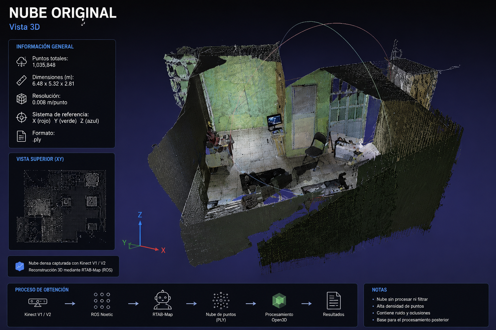
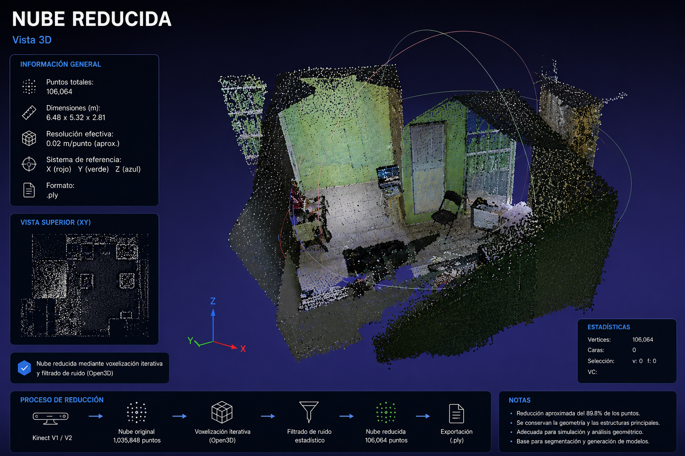
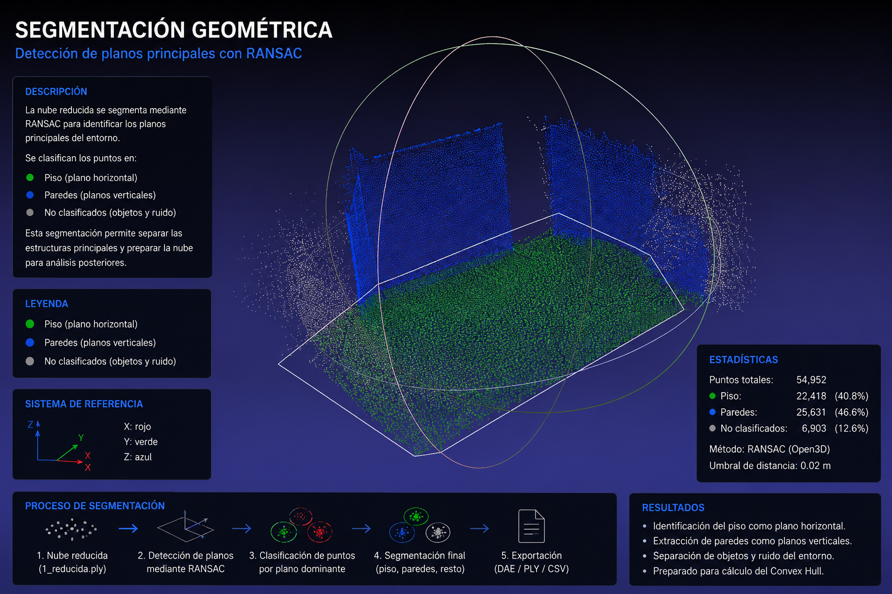
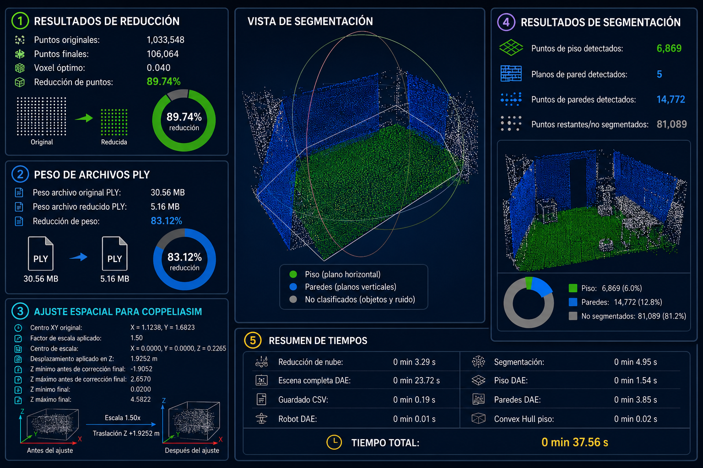

# MAPEO-3D-KINECT-V1-V2

<p align="center">
  
</p>

<p align="center">
Sistema de reconstrucción y procesamiento de nubes de puntos 3D utilizando sensores RGB-D Kinect V1/V2, ROS Noetic, RTAB-Map y Open3D.
</p>

---

# Asesores

- **Dr. Héctor Vázquez Leal**
- **Dr. Gerardo Díaz Arango**

# Desarrollador

- **IIE. Osvaldo Elí Ramos Sánchez**

---

# Descripción

Repositorio orientado al desarrollo de un sistema de adquisición, reconstrucción y procesamiento tridimensional de entornos indoor utilizando sensores RGB-D Kinect.

El proyecto integra herramientas de robótica, SLAM RGB-D y procesamiento geométrico para generar representaciones espaciales reproducibles orientadas a aplicaciones de:

- robótica móvil,
- navegación autónoma,
- simulación,
- reconstrucción 3D,
- modelado espacial indoor,
- análisis geométrico.

---

# Objetivo

Documentar, organizar y respaldar el código, configuraciones, scripts, resultados y metodología relacionados con el proceso de:

1. Captura RGB-D
2. Reconstrucción tridimensional
3. Exportación de nube de puntos
4. Reducción mediante voxelización iterativa
5. Segmentación geométrica
6. Extracción de Convex Hull
7. Exportación de resultados

---

# Arquitectura general del sistema

```text
Kinect RGB-D
      │
      ▼
ROS Noetic
      │
      ▼
RTAB-Map
      │
      ▼
Nube de puntos PLY
      │
      ▼
Postprocesamiento Open3D
      │
      ├── Voxelización iterativa
      ├── Ajuste espacial
      ├── Segmentación piso/paredes
      ├── Convex Hull
      └── Exportación
              │
              ├── PLY
              ├── CSV
              ├── DAE
              ├── TXT
              └── JSON
```

---

# Pipeline metodológico

1. Captura RGB-D mediante Kinect.
2. Reconstrucción 3D utilizando RTAB-Map.
3. Exportación de nube de puntos `.ply`.
4. Reducción mediante voxelización iterativa.
5. Ajuste espacial para simulación.
6. Segmentación geométrica basada en RANSAC.
7. Extracción de Convex Hull del piso.
8. Exportación automática de resultados.

---

# Tecnologías utilizadas

## Sistemas operativos

- Ubuntu 20.04
- Ubuntu 22.04

## Frameworks y herramientas

- ROS Noetic
- RTAB-Map
- Open3D
- CloudCompare
- CoppeliaSim

## Sensores

- Kinect V1
- Kinect V2

## Lenguajes

- Python
- Bash

---

# Características principales

- Procesamiento reproducible de nubes de puntos
- Reducción iterativa mediante voxelización
- Segmentación automática de piso y paredes
- Extracción geométrica mediante Convex Hull
- Exportación `.ply`, `.csv`, `.dae`
- Compatibilidad con simulación robótica
- Generación automática de tickets `.txt`
- Exportación de métricas `.json`

---

# Resultados visuales

## Pipeline general

<p align="center">
  
</p>

---

## Nube de puntos original

<p align="center">
  
</p>

Nube de puntos original obtenida mediante RTAB-Map utilizando Kinect RGB-D.

---

## Nube reducida mediante voxelización iterativa

<p align="center">
  
</p>

Resultado del proceso de reducción de densidad mediante voxelización iterativa controlada.

---

## Segmentación geométrica

<p align="center">
  
</p>

Separación geométrica de planos estructurales mediante segmentación basada en RANSAC.

La segmentación permite identificar:

- piso,
- paredes,
- regiones no segmentadas.

---

## Convex Hull del piso

<p align="center">
  
</p>

Contorno geométrico generado a partir de los puntos segmentados como piso utilizando Convex Hull proyectado sobre el plano detectado.

---

## Ticket de procesamiento

<p align="center">
  
</p>

Resumen automático de métricas, tiempos, reducción de puntos y resultados de segmentación generados por el pipeline.

---

# Aplicaciones

- Robótica móvil
- Navegación autónoma
- Reconstrucción 3D indoor
- SLAM RGB-D
- Simulación robótica
- Modelado espacial
- Planeación geométrica

---

# Estructura del repositorio

```text
MAPEO-3D-KINECT-V1-V2/
│
├── docs/
│   └── img/
│
├── src/
│
├── launch/
│
├── scripts/
│
├── examples/
│
├── data/
│   ├── input/
│   └── output/
│
├── results/
│   ├── ply/
│   ├── csv/
│   ├── dae/
│   ├── tickets/
│   ├── metrics/
│   └── logs/
│
├── requirements.txt
├── ros_dependencies.md
├── CHANGELOG.md
├── CITATION.cff
├── LICENSE
└── README.md
```

---

# Instalación

## Clonar repositorio

```bash
git clone https://github.com/TU_USUARIO/MAPEO-3D-KINECT-V1-V2.git

cd MAPEO-3D-KINECT-V1-V2
```

## Crear entorno virtual

```bash
python3 -m venv .venv

source .venv/bin/activate
```

## Instalar dependencias

```bash
pip install -r requirements.txt
```

---

# Dependencias principales

```text
numpy
pandas
scipy
open3d
trimesh
```

---

# Ejecución

## Ejemplo de procesamiento

```bash
python3 src/Procesar_nube_3d.py \
  --input data/input/nube_original.ply \
  --output-dir results/experimento_01 \
  --target-points 100000 \
  --tolerance 10000 \
  --voxel-start 0.015 \
  --voxel-max 0.05 \
  --voxel-step 0.001 \
  --scale-cloud 1.0 \
  --random-state 42
```

---

# Exportación DAE

```bash
python3 src/Procesar_nube_3d.py \
  --input data/input/nube_original.ply \
  --output-dir results/experimento_01 \
  --export-dae
```

---

# Resultados generados

El pipeline genera automáticamente:

- Nube reducida `.ply`
- Datos tabulares `.csv`
- Modelos `.dae`
- Ticket de procesamiento `.txt`
- Métricas `.json`
- Logs de ejecución

---

# Compatibilidad

## ROS

- ROS Noetic

## Sensores compatibles

- Kinect V1
- Kinect V2

## Formatos soportados

- `.ply`
- `.csv`
- `.dae`
- `.json`
- `.txt`

---

# Metodología reproducible

Este repositorio fue estructurado para permitir:

- reproducibilidad experimental,
- trazabilidad de resultados,
- automatización del procesamiento,
- documentación de parámetros,
- organización modular del pipeline.

---

# Documentación adicional

Consultar:

```text
docs/
```

y:

```text
ros_dependencies.md
```

---

# Licencia

Proyecto académico y de investigación.

---

# Citación

Si utilizas este repositorio para investigación académica, favor de citar el trabajo correspondiente.

---

# Estado del proyecto

🚧 Proyecto en desarrollo orientado a investigación y experimentación en mapeo 3D indoor mediante sensores RGB-D.