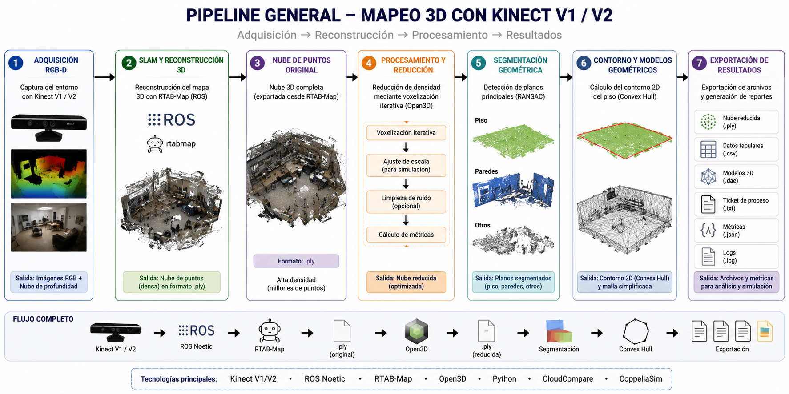
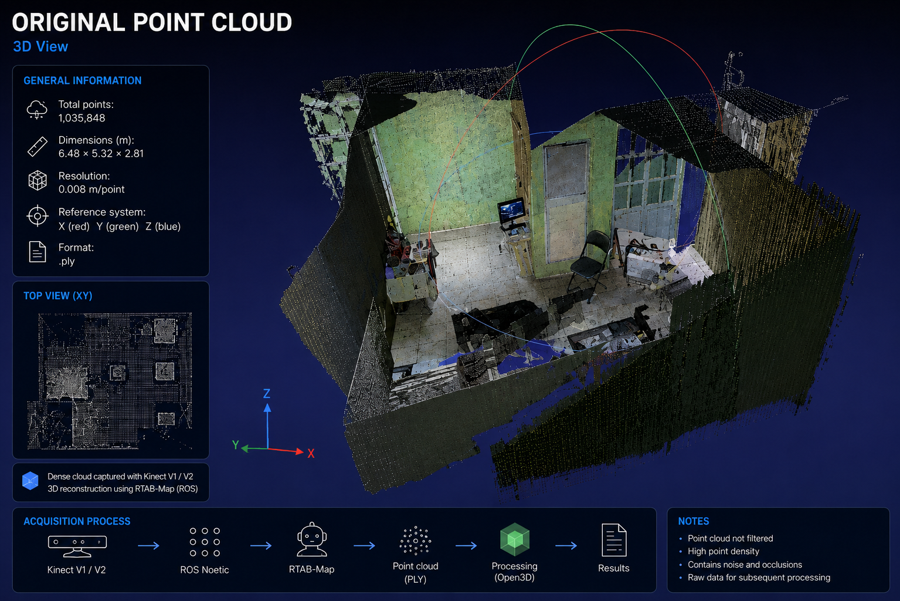
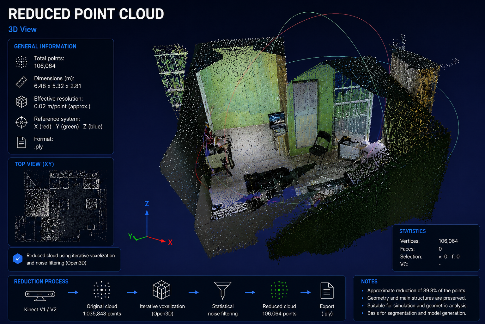
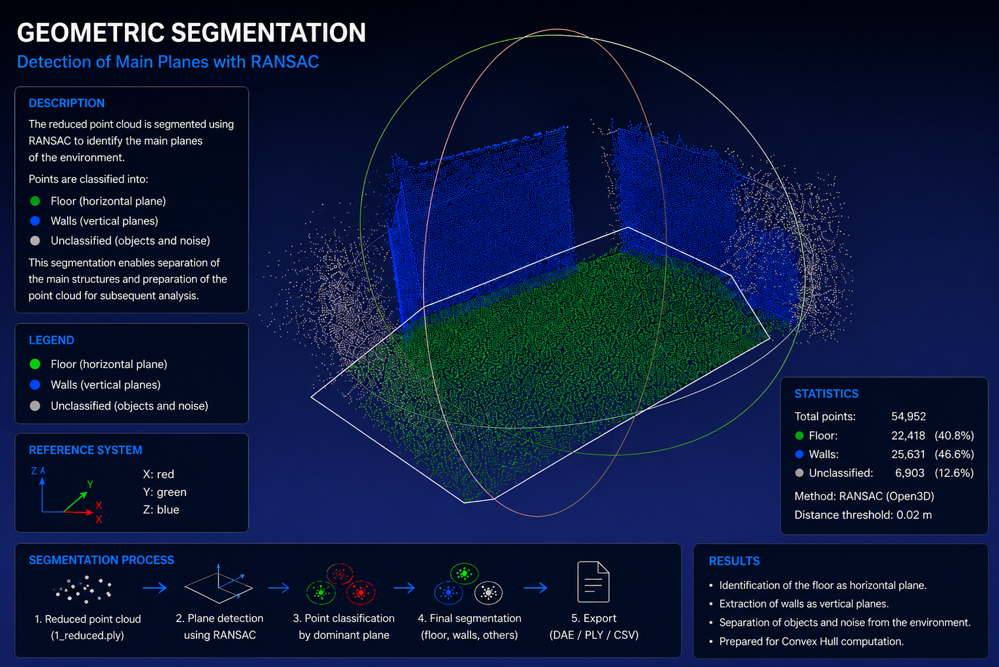
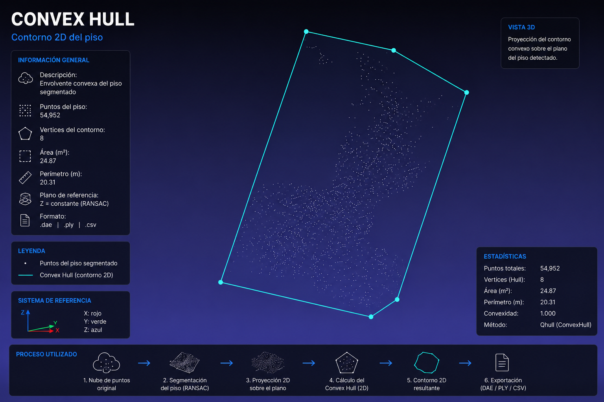
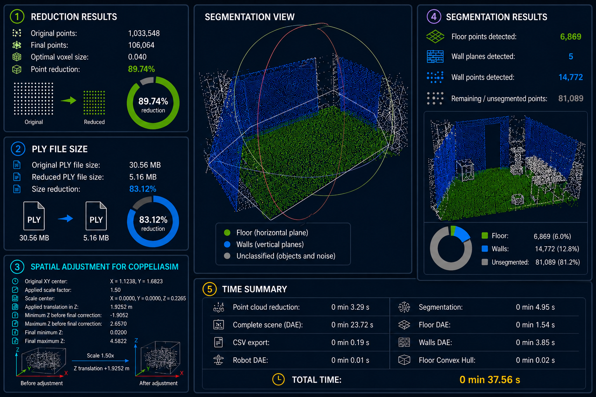

# ROS_KINECT_PROCESS

<p align="center">
  
</p>

<p align="center">
3D Point Cloud Reconstruction and Processing Pipeline using Kinect V1/V2 RGB-D Sensors, ROS Noetic, RTAB-Map, and Open3D.
</p>

<p align="center">


</p>

---

# Advisors

* **Dr. Héctor Vázquez Leal**
* **Dr. Gerardo Díaz Arango**

# Developer

* **B.E. Osvaldo Elí Ramos Sánchez**

---

# Abstract

This project presents a 3D reconstruction and point cloud processing pipeline based on Kinect V1/V2 RGB-D sensors, ROS Noetic, RTAB-Map, and Open3D. The proposed methodology focuses on indoor robotic mapping, RGB-D SLAM, geometric processing, and computational optimization through iterative voxelization techniques.

The system enables reproducible acquisition and reconstruction of indoor environments while integrating geometric segmentation, Convex Hull extraction, spatial adjustment, and automated exportation of processed results. The proposed pipeline aims to reduce computational cost while preserving the essential geometric structure of the reconstructed environment.

The repository is oriented toward robotics, autonomous navigation, robotic simulation, spatial modeling, and experimental research in 3D mapping systems.

---

# Overview

This repository focuses on the development of a complete acquisition, reconstruction, and post-processing framework for indoor 3D mapping using Kinect RGB-D sensors.

The project integrates robotics, RGB-D SLAM, and geometric processing tools to generate reproducible spatial representations suitable for:

* mobile robotics,
* autonomous navigation,
* robotic simulation,
* indoor 3D reconstruction,
* spatial modeling,
* geometric analysis,
* robotic environment representation.

---

# Main Objective

To document, organize, and support the code, configurations, scripts, methodologies, and experimental results related to:

1. RGB-D acquisition
2. 3D reconstruction
3. Point cloud exportation
4. Iterative voxelization-based downsampling
5. Geometric segmentation
6. Convex Hull extraction
7. Automated result exportation

---

# System Architecture

```text
Kinect RGB-D Sensor
        │
        ▼
ROS Noetic
        │
        ▼
RTAB-Map
        │
        ▼
PLY Point Cloud
        │
        ▼
Open3D Post-Processing
        │
        ├── Iterative voxelization
        ├── Spatial adjustment
        ├── Floor/wall segmentation
        ├── Convex Hull extraction
        └── Result exportation
                │
                ├── PLY
                ├── CSV
                ├── DAE
                ├── TXT
                └── JSON
```

---

# Methodological Pipeline

1. RGB-D acquisition using Kinect sensors.
2. 3D reconstruction using RTAB-Map.
3. Exportation of `.ply` point clouds.
4. Iterative voxelization-based reduction.
5. Spatial scaling and adjustment.
6. Geometric segmentation using RANSAC.
7. Convex Hull extraction from segmented floor regions.
8. Automated exportation of processed results.

---

# Technologies Used

## Operating Systems

* Ubuntu 20.04
* Ubuntu 22.04

## Frameworks and Tools

* ROS Noetic
* RTAB-Map
* Open3D
* CloudCompare
* CoppeliaSim

## RGB-D Sensors

* Kinect V1
* Kinect V2

## Programming Languages

* Python
* Bash

---

# Main Features

* Reproducible point cloud processing
* Iterative voxelization-based downsampling
* Automatic floor and wall segmentation
* Convex Hull extraction
* `.ply`, `.csv`, `.dae`, `.json` exportation
* Robotic simulation compatibility
* Automated processing ticket generation
* Experimental metric exportation
* Modular processing pipeline

---

# Visual Results

## General Pipeline

<p align="center">
  
</p>

---

## Original Point Cloud

<p align="center">
  
</p>

Point cloud generated using RTAB-Map and Kinect RGB-D acquisition.

---

## Reduced Point Cloud

<p align="center">
  
</p>

Result obtained after iterative voxelization-based point cloud reduction.

---

## Geometric Segmentation

<p align="center">
  
</p>

Geometric plane segmentation using RANSAC-based processing.

The segmentation process enables identification of:

* floor regions,
* wall structures,
* non-segmented regions.

---

## Convex Hull Extraction

<p align="center">
  
</p>

Geometric contour generated from segmented floor points using Convex Hull projection.

---

## Processing Ticket

<p align="center">
  
</p>

Automatically generated summary including metrics, execution times, point reduction statistics, and segmentation results.

---

# Applications

* Mobile robotics
* Autonomous navigation
* Indoor 3D reconstruction
* RGB-D SLAM
* Robotic simulation
* Spatial modeling
* Geometric planning
* Experimental robotic mapping

---

# Repository Structure

```text
ROS_KINECT_PROCESS/
│
├── docs/
│   └── img/
│
├── src/
│
├── launch/
│
├── scripts/
│
├── examples/
│
├── data/
│   ├── input/
│   └── output/
│
├── results/
│   ├── ply/
│   ├── csv/
│   ├── dae/
│   ├── tickets/
│   ├── metrics/
│   └── logs/
│
├── requirements.txt
├── ros_dependencies.md
├── CHANGELOG.md
├── CITATION.cff
├── LICENSE
└── README.md
```

---

# Installation

## Clone Repository

```bash
git clone git@github.com:Osvaldo-99/ROS_KINECT_PROCESS.git

cd ROS_KINECT_PROCESS
```

---

## Create Virtual Environment

```bash
python3 -m venv .venv

source .venv/bin/activate
```

---

## Install Dependencies

```bash
pip install -r requirements.txt
```

---

# Main Dependencies

```text
numpy
pandas
scipy
open3d
trimesh
```

---

# Execution Example

```bash
python3 src/process_point_cloud.py \
  --input data/input/original_cloud.ply \
  --output-dir results/experiment_01 \
  --target-points 100000 \
  --tolerance 10000 \
  --voxel-start 0.015 \
  --voxel-max 0.05 \
  --voxel-step 0.001 \
  --scale-cloud 1.0 \
  --random-state 42
```

---

# DAE Exportation

```bash
python3 src/process_point_cloud.py \
  --input data/input/original_cloud.ply \
  --output-dir results/experiment_01 \
  --export-dae
```

---

# Generated Results

The processing pipeline automatically generates:

* Reduced point cloud `.ply`
* Tabular data `.csv`
* `.dae` geometric models
* Processing tickets `.txt`
* Experimental metrics `.json`
* Execution logs

---

# Compatibility

## ROS Distribution

* ROS Noetic

## Supported Sensors

* Kinect V1
* Kinect V2

## Supported Formats

* `.ply`
* `.csv`
* `.dae`
* `.json`
* `.txt`

---

# Reproducible Methodology

This repository was structured to support:

* experimental reproducibility,
* result traceability,
* automated processing,
* parameter documentation,
* modular pipeline organization.

---

# Additional Documentation

See:

```text
docs/
```

and:

```text
ros_dependencies.md
```

---

# Research Scope

This repository is intended for:

* robotics experimentation,
* RGB-D SLAM research,
* indoor mapping systems,
* geometric processing research,
* robotic simulation environments,
* point cloud optimization studies.

---

# Citation

If you use this repository for academic or research purposes, please cite the corresponding work.

---

# License

Academic and research-oriented project.

---

# Project Status

🚧 Active research and development project focused on indoor 3D mapping using RGB-D sensors, ROS Noetic, RTAB-Map, and Open3D.
